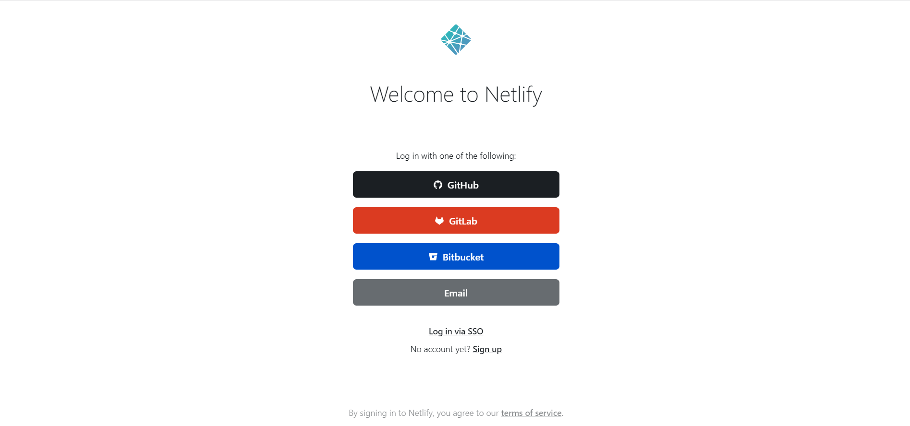
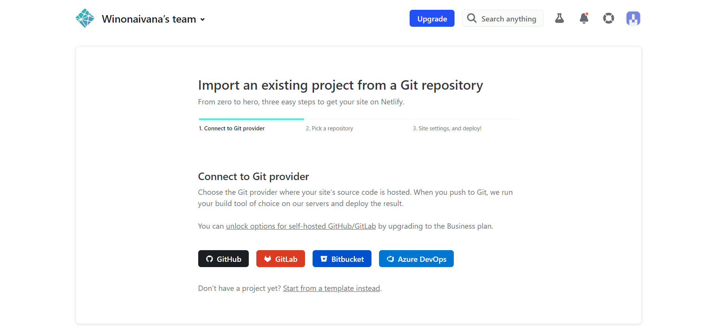
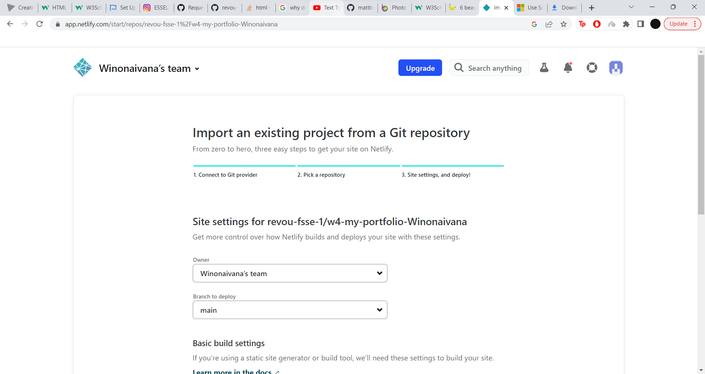
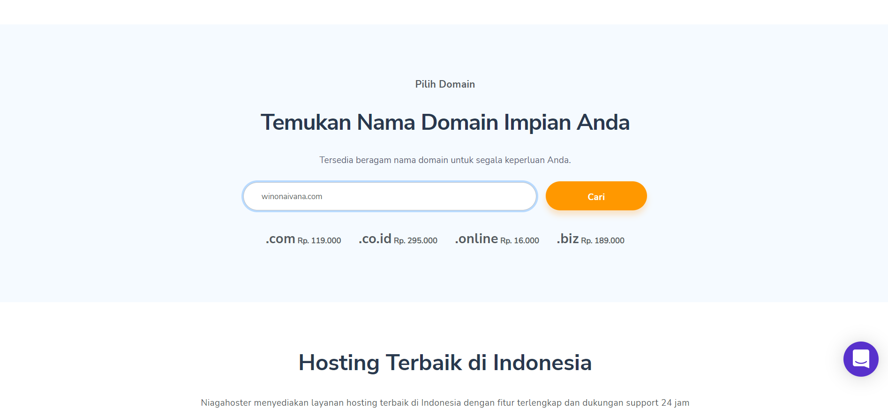
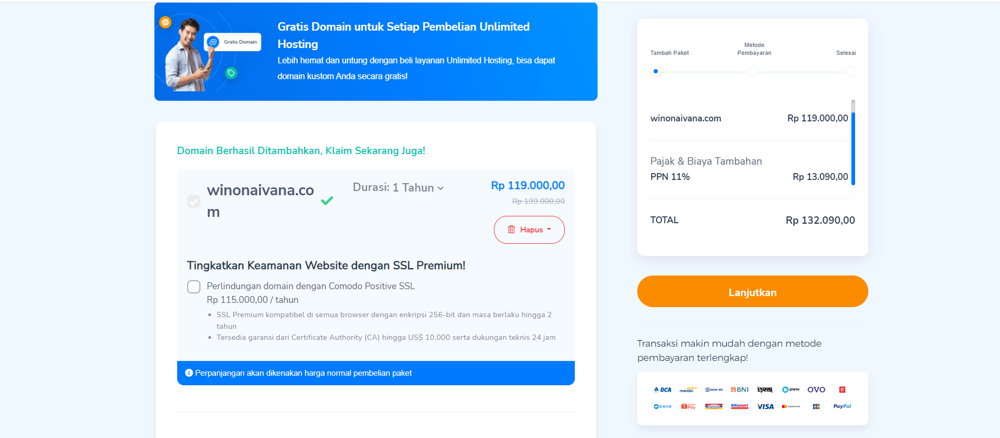
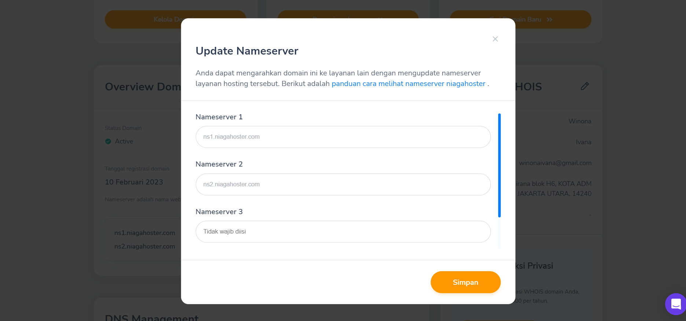
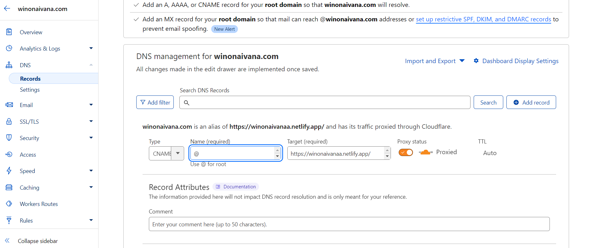

# Deployment and Custom Domain Setup 💁🏻‍♀️

Explanation/documentation on the process of deploying a project to Netlify, buying a domain from Niagahoster and connect custom domain to Netlify.
 
 
 

## Links

Netlify: [https://winonaivanaa.netlify.app/](https://winonaivanaa.netlify.app/)  
Custom Domain: [http://winonaivana.com/](http://winonaivana.com/)
 
 
 

## Deployment to Netlify 🔥

1. Sign up/log in to Netlify.
   

2. Once you're logged in, select "Add new site".

3. Select import an existing project since we are importing from a git repository.

4. Then we can connect to a git provider, which in this case is git hub.
   
5. Choose your organisation and select the repository where your project is.
   
6. Lastly, you can just click on deploy site.
    
    
    

## Buying custom domain 👾

1. The are many domain registrar, for this assignment I will be using Niagahoster.

2. You can start by typing your chosen domain name.
   
3. If it is available you can click on it and start the payment process using your prefered method.
   
    
    
    

## Connecting to Netlify through Niagahoster 💫

You can also connect it to Cloudflare as explained in the lecture or not.

1. Open Netlify and add select your site that you want to custom domain.

2. Select domain settings and click "Add domain"

3. Type in your domain name.

4. If you haven't configure the DNS settings, you can input the Nameservers given by Netlify. By selecting "Change Nameserver" in the Niagahoster website.
   
5. Then your website should work.
    
    
    

## Connecting to Netlify through cloudflare ✌️

1. Signup/login to your account

2. Add your site

3. Enter your site and change the nameservers on your chosen
   domain registrar with the ones given by Cloudflare.

4. Select DNS records and "Add record"

5. Add CNAME record and type the name of your netlify subdomain without the https://
   
6. Once added you can go on Netlify and add domain. And you don't have to change the nameservers with the ones provided by Netlify to configure your DNS since it had been configured through Cloudflare.
